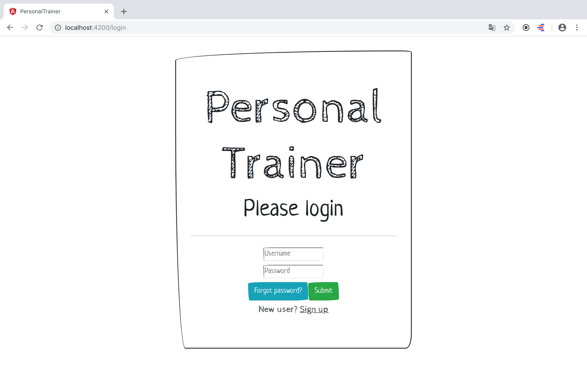
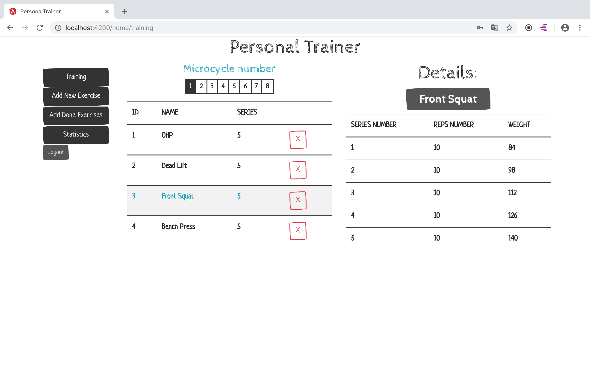
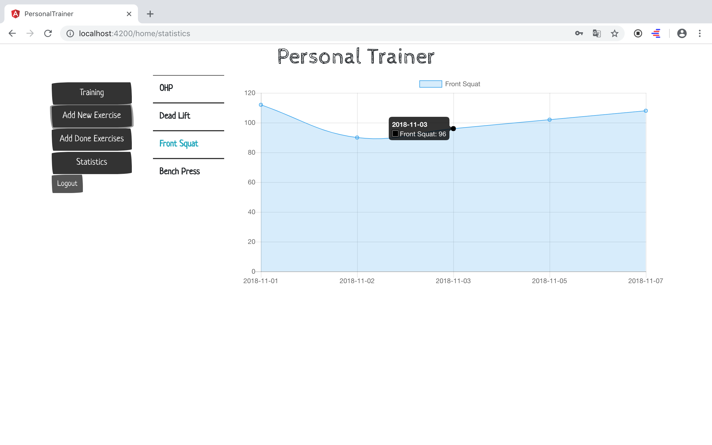

# Personal Trainer
> It's a tool for planing your gym trainings. Set-up your max weight and generate microcycles, which help you gain maxiumum effects.

## Table of contents
* [Project info](#general-info)
* [Screenshots](#screenshots)
* [Technologies](#technologies)
* [Setup](#setup)
* [Features](#features)
* [Status](#status)
* [Inspiration](#inspiration)
* [Contact](#contact)

## General info
I'm making this app for two  reasons. Firstly because I need tool for my trainings (I always forget what weight should I put on bar). Second - because I wanted to tought Angular and Spring Security. 

## Screenshots

## Technologies
* Java8
* Spring Boot - version 2.0.2
* Spring Security - version 2.0.2
* MySQL
* Hibernate
* Angular - version 6.0.8.

## Setup
Download repository and run in your IDE. You may check working app [here](https://tomirsz1987.github.io/login)

## Features
* Adding a exercises and save them in database
* Generate microcycles for your future trainings
* You can predicated how strong you will be

To-do list:
* Add tests for controllers 
* Add integration tests
* Add tests for frontend
* Add form validators (back)
* Add signup async validators
* Clean up code and refactor
* Deploy finished app

## Status
Project is: _in progress_

## Inspiration
Project inspired by Dhiraj Ray(https://plus.google.com/+DhirajRay1) - thanks buddy, you are making a great work! I learned a lot of about Spring Security and Angular. 

## Contact
Created by [Tomir](https://www.tomirszulc.pl/) - feel free to contact me!
